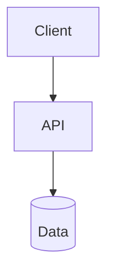

# Codebase Map: <product name>

## 1. What this is, in plain language
One page: what the application does, who uses it, and how a typical request travels through it from the user's action to the data and back.

## 2. Stack and how to run it
| Item | Value | Source |
|---|---|---|
| Languages and frameworks | | |
| Package manager | | |
| Install | | |
| Run (dev) | | |
| Build | | |
| Test | | |

## 3. Architecture


## 4. Folder structure
```
repo/
  folder/     purpose
```

## 5. Modules
| Module | Responsibility | Main files | Depends on | Used by |
|---|---|---|---|---|
| | | | | |

Notable: circular dependencies, modules everything depends on.

## 6. Entry points
| Kind | Where | What starts |
|---|---|---|
| Server start | | |
| Routes or commands | | |
| Scheduled or background jobs | | |

## 7. Data
| Store | Entity or collection | Key fields | Defined in |
|---|---|---|---|
| | | | |

## 8. Interfaces
**Endpoints, events, and commands**
| Method and path or event | Handler | Notes |
|---|---|---|
| | | |

**External services called**
| Service | Used for | Called from |
|---|---|---|

## 9. Configuration
Names only, never values.
| Variable or setting | Purpose | Default | Defined or read in |
|---|---|---|---|
| | | | |

## 10. How the code actually behaves
- **Error handling:**
- **Logging** (where, format, levels, whether requests can be traced):
- **Authentication and authorization:**
- **Validation:**
- **Retries and timeouts:**

## 11. Tests
What exists, how to run it, and what is not covered.

## 12. Feature-to-code map
| Feature or journey | Entry point | Path through the code (files and functions) | Data touched |
|---|---|---|---|
| | | | |

## 13. Where to look when X breaks
| Symptom | Likely area | Files and functions | Log or signal to check | How to confirm |
|---|---|---|---|---|
| | | | | |

## 14. How to debug here
Commands to run the app locally, enable verbose logging, run one test, and attach a debugger, from the project's own scripts.

## 15. Hotspots
| Area | Evidence | Why it matters |
|---|---|---|
| | | |

## 16. Unverified items
Things that could not be confirmed from the code, and what would confirm them.

## 17. Questions for the owner
