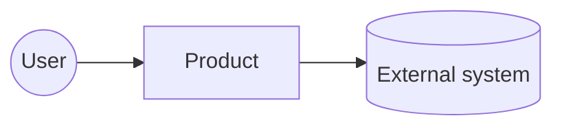
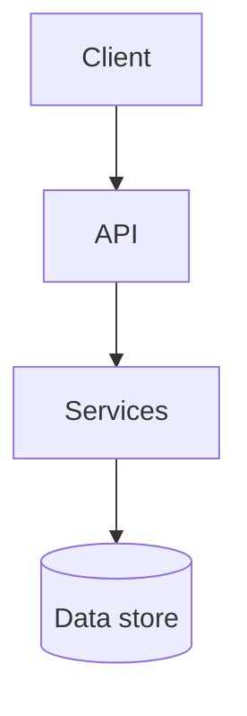

# High-Level Design: <product name>

## 1. Summary
What is being built and the shape of the solution, in one paragraph.

## 2. Context

Actors, external systems, and what crosses each boundary.

## 3. Current state (existing codebase only)
Entry points, main modules, data stores, how things are wired, and what is known to be fragile. Cite paths.

## 4. Architecture

| Component | Responsibility | Serves |
|---|---|---|
| | | FR-001 |

## 5. Architecture decisions
| ID | Decision | Options considered | Why | Cost to the owner |
|---|---|---|---|---|
| ADR-001 | | | | |

## 6. Stack
| Layer | Choice | Reason |
|---|---|---|

## 7. Data flow for the core journeys
One short description or diagram per journey (J-1, ...), showing which components it touches.

## 8. Code organization
**Folder structure**
```
src/
  feature-a/      one-line purpose
  shared/         one-line purpose
```
**Rules:** where a feature's code lives, allowed dependency directions, naming and layering conventions.

**Feature map**
| Requirement | Module | Main files |
|---|---|---|
| FR-001 | | |

## 9. Deployment and operations
Environments, hosting, configuration and secrets, release and rollback.

## 10. Security and privacy
Authentication, authorization, data protection, and what is deliberately out of scope.

## 11. Observability
Logging approach, correlation IDs, error reporting, health checks, and alerts. Details in the LLD.

## 12. How each non-functional requirement is met
| NFR | Mechanism | Verified by |
|---|---|---|
| NFR-001 | | |
| NFR-004 (debuggability) | | |
| NFR-005 (maintainability) | | |

## 13. Risks and open questions
| ID | Risk | Mitigation |
|---|---|---|
