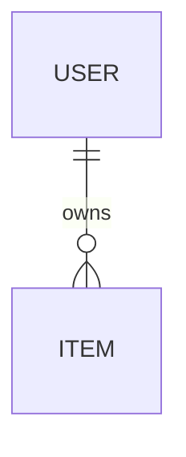
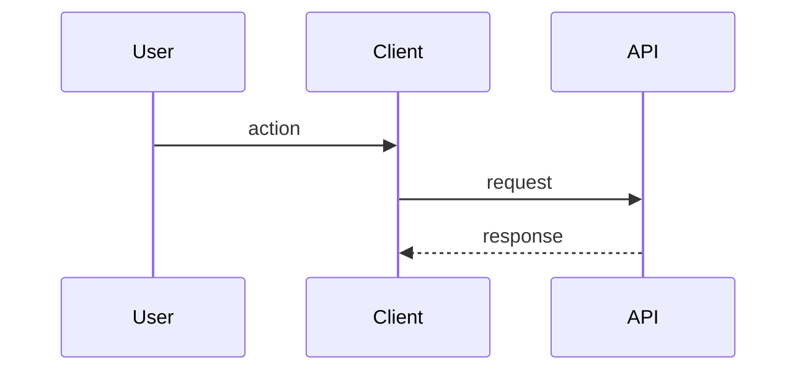

# Low-Level Design: <product name>

## 1. Modules
One subsection per module from the HLD. State responsibility, public interface, internal structure, and dependencies.

### M-001 <module>
- **Serves:** FR-001
- **Files:**
- **Depends on:**

## 2. Data model

| Entity | Field | Type | Constraints | Notes |
|---|---|---|---|---|
| | | | | |

**Indexes:**
**Migrations:** order, and how to roll back.

## 3. API contracts
### API-001 `POST /resource`
- **Serves:** FR-001
- **Auth:**
- **Request:**
```json
{}
```
- **Response (success):**
```json
{}
```
- **Validation:**
- **Errors:** E-xxx, E-xxx

(One block per endpoint, message, or event.)

## 4. Sequence diagrams
### J-1 <journey>


## 5. State machines
Only for things with a lifecycle. Show states, transitions, and the events that cause them.

## 6. Error catalog
| Code | HTTP / type | User-facing message | Cause | Logged where | What to do |
|---|---|---|---|---|---|
| E-001 | | | | | |

## 7. Logging conventions
- **Format:** structured, one event per line.
- **Required fields:** timestamp, level, correlation ID, module, event name, error code.
- **Levels:** what belongs in each.
- **Never log:** secrets, tokens, personal data.
- **Where logs go and how to read them:**

## 8. Configuration
| Setting | Purpose | Default | Set by | Secret? |
|---|---|---|---|---|

## 9. Debugging playbook
| Symptom the user sees | Likely cause | Where to look (file, log event) | How to confirm | Error code |
|---|---|---|---|---|
| | | | | |

One row for every step of every MUST journey that can fail.

## 10. Delta and migration (existing codebase only)
| Area | Current | Target | Steps | Rollback |
|---|---|---|---|---|

## 11. Requirement coverage
| Requirement | Modules | APIs | Tables | Screens |
|---|---|---|---|---|
| FR-001 | | | | |

## 12. Open questions
