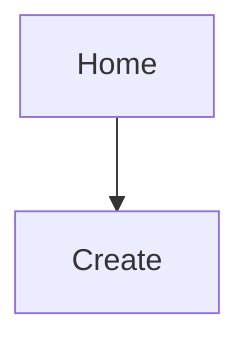
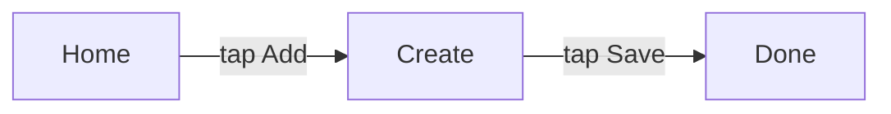

# UX Design: <product name>

## 1. Platforms and principles
- **Primary platform:**
- **Other platforms:**
- **Navigation style:**
- **Principles** (each tied to a UX- requirement, with a number):

## 2. Screen inventory
| ID | Screen | Purpose | Serves | Reached from | States |
|---|---|---|---|---|---|
| S-001 | Home | | FR-001, UX-001 | app start | populated, empty, loading, error, first-time |

## 3. Navigation map

**Rules:**
- Top-level destinations (max):
- Maximum depth from home to any screen:
- Where the primary action lives:
- How the user always gets back:

## 4. Journeys
### J-1 <name>

| Step | Action | Counts as |
|---|---|---|
| 1 | | tap |

- **Steps counted:** n
- **Budget (from PRD):** n
- **Result:** pass | fail
- **What was cut to get here, and why:**

## 5. Wireframes
### S-001 Home
```
+--------------------------------+
| Title                    [ + ] |
+--------------------------------+
|                                |
+--------------------------------+
```
**States:** empty (...), loading (...), error (...).

## 6. Interaction and content rules
- Validation:
- Empty states:
- Errors (what happened, what to do):
- Destructive actions and undo:
- Keyboard and accessibility:

## 7. Prototype
- **Location:** `docs/prototype/index.html`
- **Open on Windows:** `start docs\prototype\index.html`
- **Measured results**
| Journey | Budget (taps) | Measured taps | Measured seconds | Pass | User feedback |
|---|---|---|---|---|---|

## 8. Requirement coverage
| Requirement | Screens | Journey |
|---|---|---|
| UX-001 | S-001, S-002 | J-1 |
| FR-001 | | |

Every UX- and every MUST FR- requirement appears here.

## 9. Open questions
